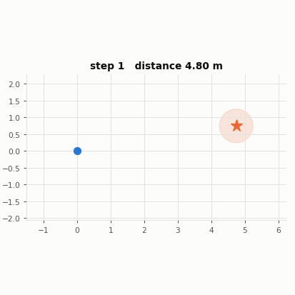
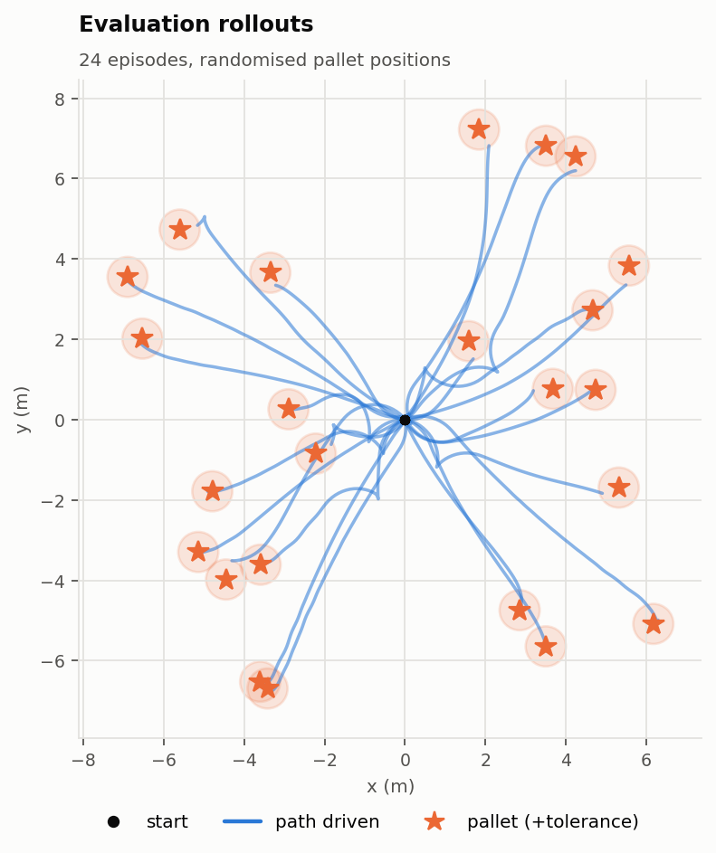
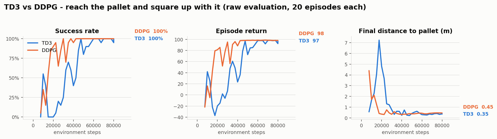
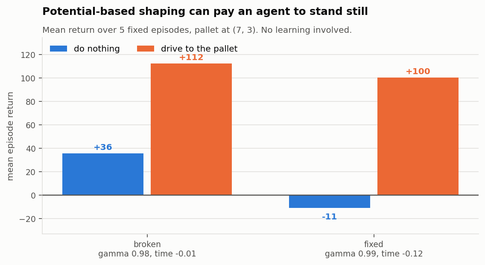
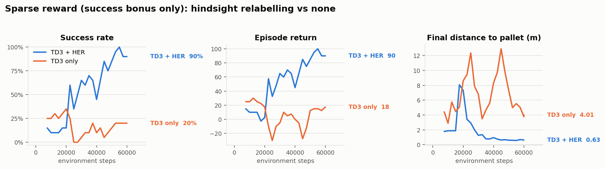
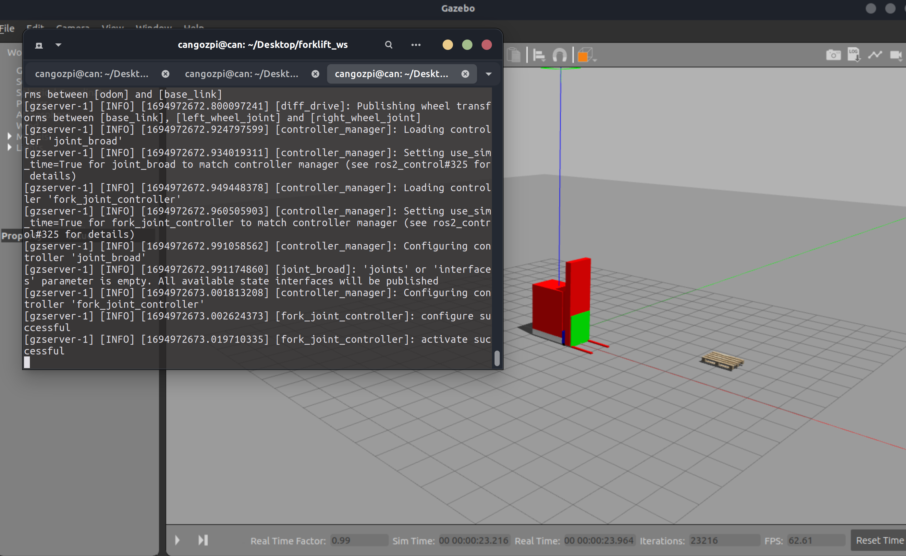
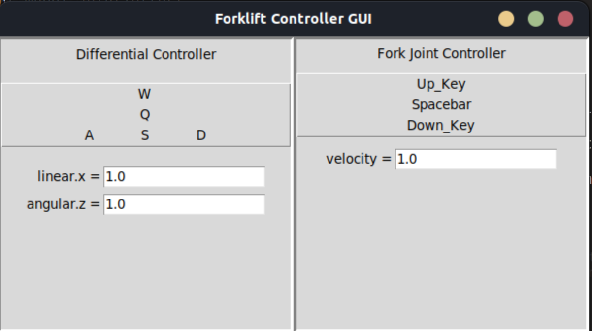

# Deep RL Forklift Simulation

Training a forklift to drive up to a pallet and square up with it, in **ROS 2 +
Gazebo** — with a fast ROS-free simulator alongside it so the reward function can
be iterated on in minutes instead of days.

<p align="center">
  
</p>

```bash
pip install -r requirements-dev.txt
export PYTHONPATH=$PWD/src/forklift_gym_env
python -m forklift_gym_env train -c td3_kinematic.yaml
```

That is the whole setup for the fast path. No ROS, no Gazebo, no colcon — it
trains to a 100% success rate in about five minutes on a laptop CPU. The Gazebo
path is the same command with `-c td3_gazebo.yaml` once the workspace is built.

---

## Contents

- [What's here](#whats-here)
- [Results](#results)
- [The simulation itself](#the-simulation-itself)
- [Why there are two simulators](#why-there-are-two-simulators)
- [Quick start](#quick-start)
- [The Gazebo path](#the-gazebo-path)
- [Configuration](#configuration)
- [Repository layout](#repository-layout)
- [Testing](#testing)
- [Notes on the rewrite](#notes-on-the-rewrite)
- [Credits](#credits)
- [License](#license)

---

## What's here

**The robot.** A URDF/xacro forklift with a differential drive, a liftable fork,
an RGB camera, a depth camera, LiDAR and per-link contact sensors, driven through
`ros2_control`, plus a custom Gazebo collision-detection plugin.

**The environment.** A Gymnasium `Env` with pluggable observations, composable
reward terms and a goal curriculum — backed either by Gazebo or by a fast
kinematic simulator, chosen by one line of config.

**The learning.** TD3 and DDPG in PyTorch, a uniform replay buffer and a real
Hindsight Experience Replay buffer, with TensorBoard and CSV logging,
checkpointing and deterministic evaluation.

**Two tasks.**

| | Goal | Tolerance |
|---|---|---|
| **point-goal** | reach the pallet | 0.6 m |
| **alignment** | reach it *and* match its heading | 0.5 m, 20° |

The second one is the forklift problem: forks only go in from one side, so
arriving at the pallet facing the wrong way is not a success.

---

## Results

All figures below are from runs in this repository and can be reproduced with
the commands shown. Single seed unless stated — enough to show the mechanisms
work, not enough to rank algorithms; see the caveat under the comparison.

### The trained policy generalises over pallet placement



24 evaluation episodes, pallet sampled uniformly over a 2–8 m annulus at any
bearing, robot starting at the origin with a random heading. **100% success,
0 collisions, mean final distance 0.20 m.**

```bash
python -m forklift_gym_env eval -c runs/<run>/config.yaml runs/<run>/best.pt \
    -n 24 --plot trajectories.png --gif rollout.gif
```

Randomised placement is what makes this figure mean anything: the pallet moves
every episode, so the number measures generalisation rather than one memorised
trajectory.

### TD3 vs DDPG on the alignment task



Identical environment, network, buffer and schedule; the only differences are
TD3's clipped double-Q, target policy smoothing and delayed actor update.

| | first 100% eval | final success | final distance |
|---|---|---|---|
| DDPG | 30,000 steps | 100% | 0.45 m |
| TD3 | 47,500 steps | 100% | 0.35 m |

On this task DDPG gets there first and TD3 ends more precisely. That is not the
textbook result, and with **one seed per algorithm it is not evidence of
anything** — the honest summary is that this task is easy enough for both.
Re-run with `--set run.seed=N` across several seeds before drawing a conclusion.

```bash
python -m forklift_gym_env train -c td3_align_kinematic.yaml
python -m forklift_gym_env train -c ddpg_align_kinematic.yaml
python -m forklift_gym_env report runs/<td3> runs/<ddpg> --labels TD3 DDPG -o compare.png
```

### A reward function that pays the agent to stand still



Potential-based shaping adds `γ·Φ(s′) − Φ(s)`. With `Φ = −distance` and a
**stationary** robot that is not zero — it is `(1 − γ)·distance`, which is
*positive*. A distant agent earns a small income every step for doing nothing.

The bars are hand-written policies, no learning involved: a do-nothing policy
and a proportional controller, run under two reward weightings. Under the broken
one, **doing nothing scores +36**. Driving still scores higher, so idling is not
the global optimum — but it is a positive-return local optimum sitting right
where an agent starts, before it has ever reached the pallet and discovered the
success bonus.

Does it actually break training? On *this* task, no — run both weightings for
25,000 steps and they both reach 100%, with both dipping partway through. So the
guard below is a safeguard against a reward function that is provably wrong, not
the rescue of a run that was failing. Saying otherwise would be easy and would
not be true; `scripts/reward_shaping_demo.py --steps 25000` reproduces the
inconclusive comparison too.

The config loader now refuses any weighting where the per-step cost does not
exceed the maximum idle income, and states the threshold:

```
ConfigError: reward.time (-0.01) does not out-cost potential-based shaping: a
stationary agent 8 m from the goal still earns +0.1600/step at gamma=0.98, so
idling beats driving. Set reward.time steeper than -0.1600, or raise algo.gamma.
```

```bash
python scripts/reward_shaping_demo.py     # reproduces the figure
```

### Hindsight replay on a sparse reward



Every shaping term switched off — the agent is paid only for arriving. Same
observation content on both sides (robot pose, velocity, last action, goal); the
only difference is whether failed episodes get relabelled with the state the
robot actually reached.

| | final success | final distance | episode length |
|---|---|---|---|
| TD3 + HER | **90%** | 0.63 m | 74 |
| TD3 alone | 20% | 4.01 m | 198 |

Without relabelling the agent occasionally stumbles into a near goal during
warm-up, learns a little, then loses it — the classic sparse-reward failure.
Relabelling is what turns those near misses into usable signal, and it is worth
checking that a buffer named HER actually performs it.

---

## The simulation itself

Screenshots from the Gazebo side of the project — the robot, its controllers and
its sensor stack, running under ROS 2 Humble.

> These predate the v1.0 rewrite: they document the robot description, the
> controllers and the sensor pipeline, all of which are carried over unchanged.
> They are not screenshots of the rewritten backend — see the status note under
> [The Gazebo path](#the-gazebo-path).

<p align="center">
  
</p>

The forklift and a pallet in the `collision_detection` world, with
`controller_manager` bringing up `joint_broad` and `fork_joint_controller`.

<p align="center">
  
  
</p>

LiDAR and depth camera. Left: RViz with the `/scan` point cloud and the depth
image panel. Right: the LiDAR rays as Gazebo casts them, next to the raw depth
frame the subscriber receives.

<p align="center">
  
</p>

The RGB camera. Swap it for the depth camera by commenting the include in
`src/forklift_robot/urdf/forklift.urdf.xacro`:

```xml
<xacro:include filename="lidar.xacro"/>
<!-- <xacro:include filename="camera.xacro"/> -->
<xacro:include filename="depth_camera.xacro"/>
```

<details>
<summary>The Tk GUI controller this replaced</summary>

<p align="center">
  
</p>

Manual driving used to go through a Tk window, which needed a display and
duplicated the publisher logic already in the environment. It is now
`make teleop` — a keyboard controller that works over ssh and in the container.

</details>

---

## Why there are two simulators

Gazebo is the right tool for validating contact, sensors and controller
dynamics. It is the wrong tool for iterating on a reward function: a change you
want to evaluate over 60,000 environment steps costs hours of wall clock, so in
practice you evaluate it over 200 steps and guess.

So the simulator sits behind an interface:

```
ForkliftEnv  ──►  SimulationBackend  ──┬──►  KinematicBackend   (numpy, ~13,500 steps/s)
                                       └──►  GazeboBackend      (rclpy + gazebo_ros)
```

The contract is one frozen dataclass in each direction: `WorldState` out,
`DriveCommand` in. Rewards, observations, buffers and the agent never import
`rclpy`.

| | kinematic | Gazebo |
|---|---|---|
| env steps / second | ~13,500 (measured, one CPU core) | bounded by physics plus two service round-trips per step — orders of magnitude slower |
| needs ROS | no | yes |
| models | unicycle kinematics, accel limits, actuation noise, circular obstacles | full rigid-body physics, contacts, meshes, sensors, `ros2_control` |
| use it for | rewards, observations, hyperparameters, CI | validating the result |

Workflow: tune on the fast one, change `backend: kinematic` to `backend: gazebo`,
re-run. Same config, same code path, same reward.

The fast sim is not a physics engine and is not pretending to be one. Anything
that depends on contact dynamics, wheel slip, sensor noise or mesh geometry has
to be checked in Gazebo. It carries multiplicative actuation noise specifically
so a policy cannot learn to exploit a perfectly deterministic transition model.

---

## Quick start

```bash
git clone <this repo> && cd ros2-forklift-rl-sim
pip install -r requirements-dev.txt
export PYTHONPATH=$PWD/src/forklift_gym_env

make configs                         # what's available
make test                            # 119 tests, ~6 s, no ROS
make train                           # td3_kinematic.yaml
make train CONFIG=td3_align_kinematic.yaml
make evaluate RUN=runs/<dir>         # metrics + trajectory plot + GIF
make tensorboard
```

Everything is also reachable through the CLI directly:

```bash
python -m forklift_gym_env train -c td3_kinematic.yaml --set train.total_steps=5000
python -m forklift_gym_env eval  -c runs/<dir>/config.yaml runs/<dir>/best.pt -n 20
python -m forklift_gym_env report runs/a runs/b --labels A B -o compare.png
python -m forklift_gym_env config -c td3_gazebo.yaml     # print the resolved config
```

`--set` takes dotted paths and YAML-parses the value:
`--set env.goal.distance_range="[3, 5]"`.

---

## The Gazebo path

Requires **ROS 2 Humble** and **Gazebo 11** on Ubuntu 22.04, or the Docker image.

> **Status.** The Gazebo backend was rewritten alongside everything else but has
> not been re-run end to end since — the machine this rewrite was done on had no
> ROS installation. Its logic is reviewed and its config is validated in CI, and
> the kinematic backend it shares every line of task code with is covered by the
> test suite, but treat the first Gazebo run as something to watch rather than
> something to trust. The numbers in [Results](#results) are all from the
> kinematic backend.

```bash
make deps      # rosdep install from package.xml
make build     # colcon build --symlink-install
source install/setup.bash

make sim            # terminal 1 — headless; add `make sim-gui` to watch
make train-gazebo   # terminal 2
```

`make teleop` drives it by hand from a terminal. `make rviz` opens the sensor
view. `make kill-gazebo` clears up if a run leaves `gzserver` behind.

### Docker

```bash
docker build -t forklift .
docker run -it --rm --net=host -e DISPLAY=$DISPLAY \
    -v /tmp/.X11-unix:/tmp/.X11-unix:rw -v "$PWD":/ws -w /ws forklift
```

The image has a second `lite` stage with no ROS at all, for the fast sim and CI:
`docker build --target lite -t forklift-lite .`

### What makes the Gazebo backend fast enough to train in

- **One ROS node** for the whole run, with every service client and publisher
  cached on it and a single executor. Creating a node per service call spins up a
  fresh DDS participant each time; at twice per step and eight or more times per
  reset, that alone dominates the step cost.
- **Teleport, don't respawn.** Resets move entities with
  `/gazebo/set_entity_state` and zero their twist. Nothing is deleted, the
  controllers stay loaded, and no fixed `sleep()` sits in the reset path.
- **Physics uncapped.** The world sets `real_time_update_rate: 0`; the
  environment paces itself off `/clock`, so real time is not the limit.
- **Every wait has a timeout** and raises a named error instead of spinning
  forever.

---

## Configuration

One YAML file per experiment, parsed into typed dataclasses. **Unknown keys are
an error**, with the valid names listed — a misspelled key fails at load time
instead of silently doing nothing.

```yaml
env:
  backend: kinematic
  observation: [goal_vector_body, goal_distance, heading_error, velocity, last_action]
  goal:
    randomize: true
    distance_range: [2.0, 8.0]
    curriculum: {enabled: true, initial_distance: 2.5, final_distance: 8.0}
  reward:
    progress: 1.0      # potential-based shaping on distance
    heading: 0.05      # potential-based shaping on bearing
    success: 100.0
    collision: -50.0
    time: -0.12
    action_smoothness: -0.05
algo:
  name: td3
  gamma: 0.99
  policy_delay: 2
  use_her: false
```

The observation space is *derived* from the `observation` list, so it cannot
drift out of sync with what the environment actually returns. Adding a feature
resizes the space and the networks automatically.

Full reference: **[docs/configuration.md](docs/configuration.md)**.
Design: **[docs/architecture.md](docs/architecture.md)**.

---

## Repository layout

```
src/
  forklift_robot/              the robot itself
    urdf/                      forklift + sensor xacros
    config/                    ros2_control controllers
    launch/forklift_sim.launch.py    one launch file, arguments for the variants
    forklift_robot/teleop.py   keyboard driving
  ros_gazebo_plugins/          C++ contact-sensor plugin
  forklift_gym_env/
    config/                    the experiment YAMLs
    worlds/  models/           Gazebo worlds and the pallet mesh
    forklift_gym_env/
      config.py                typed config + validation
      geometry.py              Pose2D, angle wrapping, quaternions
      paths.py                 locate packaged data via the ament index
      envs/
        forklift_env.py        the Gymnasium env, goal sampling, curriculum
        backends/              base.py · kinematic.py · gazebo.py
        observations.py        feature registry
        rewards.py             reward-term registry
        actions.py             normalised action -> rate-limited velocity
      rl/                      networks.py · buffers.py · td3.py · train.py
      utils/                   seeding · logging · viz
      tests/                   119 tests
      cli.py
scripts/reward_shaping_demo.py
docs/                          architecture · configuration · rewrite-notes · figures
```

---

## Testing

```bash
make test        # 119 tests, ~6 s
make coverage
make lint        # ruff check + format check
```

No ROS, no Gazebo, no GPU. That is the payoff from putting the simulator behind
an interface, and it is what lets CI run on a stock GitHub runner across Python
3.10–3.12, validate every shipped config, and smoke-train end to end on every
push.

The tests are written against the failures that actually happened, not for
coverage: angle wrapping across ±π, the observation space matching the
observation, potential-based shaping telescoping, HER manufacturing successes
where a plain buffer yields none, `update()` surviving every policy delay, every
target parameter being frozen, truncation staying distinct from termination.

---

## Notes on the rewrite

This is version 1.0, a rewrite of the Python side. The robot itself — the URDF
and meshes, the Gazebo worlds, the C++ contact-sensor plugin — is carried over
from the original project essentially unchanged. Having a working robot
description and a working plugin to build on is most of what made the rest of
this possible.

**[docs/rewrite-notes.md](docs/rewrite-notes.md)** is the engineering change
log: what the v1.0 stack does differently and the reasoning behind each
decision, including the bugs fixed on the way. It is written for anyone doing
similar work, because RL code fails quietly — a training curve can look
completely reasonable while something underneath it is wrong.

The entry worth reading is a bug introduced *during* this rewrite — the
shaping/idling trap above — and what it took to measure it honestly. The first
framing of that result attributed a 15%→100% jump to the reward change;
re-running with only the reward changed showed the effect is real but much
smaller than that. The measured version is the one in the figure.

---

## Credits

This project builds on [cangozpi](https://github.com/cangozpi)'s forklift
simulation. The URDF, the Gazebo worlds and the contact-sensor plugin are
theirs, as is the companion [differential-drive navigation
environment](https://github.com/cangozpi/Custom-Differential-Drive-Navigation-Environment-and-Deep-Reinforcement-Learning-Agents)
linked above — the modelling and plugin work that the rest of this stands on.
The v1.0 Python stack — environment, backends, RL, packaging, tests — is a
rewrite.

Built on ROS 2 Humble, Gazebo 11, Gymnasium and PyTorch. The TD3 implementation
follows Fujimoto et al. (2018); the shaping argument is Ng, Harada & Russell
(1999); hindsight relabelling is Andrychowicz et al. (2017).

## License

Apache License 2.0.
