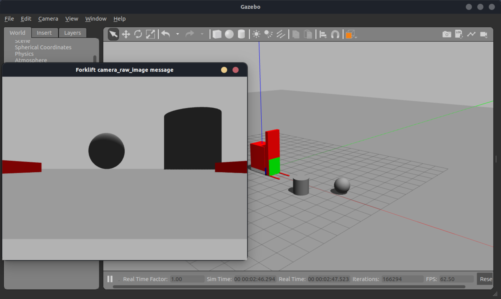
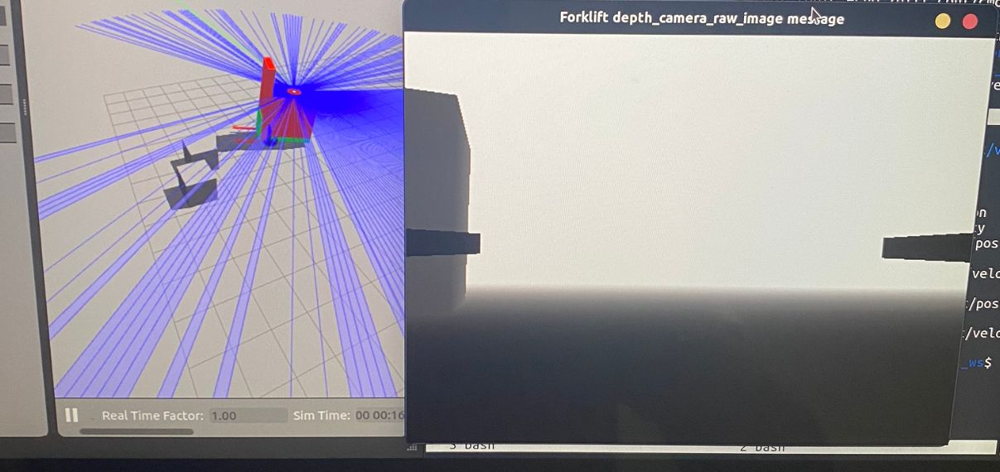
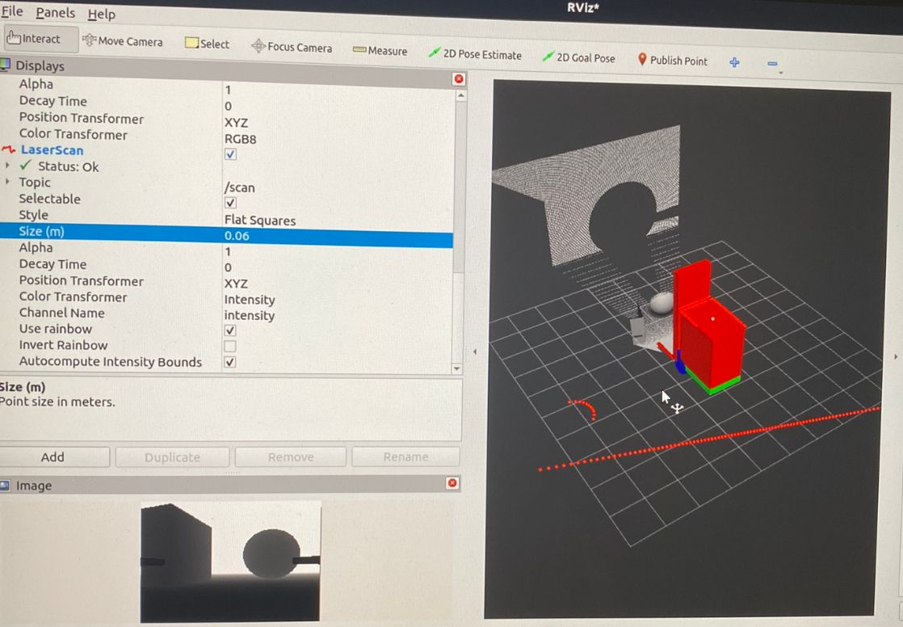

# Deep Reinforcement Learning Forklift Simulation

This repository provides a **ROS2 + Gazebo** simulation for training **Deep Reinforcement Learning (DRL)** agents to control a simulated **forklift** — for example, to autonomously navigate to and align with a pallet.

You get:

- ✅ A complete **forklift robot model** (URDF, ROS2 controllers, sensors)
- ✅ A **Gazebo/ROS2-backed Gym environment** (`ForkliftEnv`)
- ✅ Multiple **RL algorithms** (custom PyTorch + Stable Baselines3)
- ✅ **Config-based** experiment setup (reward, observations, actions, step duration)
- ✅ A **manual GUI controller** to test/tune the forklift without training

This repo is designed as a **research / experimentation playground** so you can swap observation, reward, or action strategies without rewriting the environment.

---

## 🗂️ Table of Contents

1. [Features](#features)
2. [Repository Structure](#repository-structure)
3. [Requirements](#requirements)
4. [Installation](#installation)
5. [Build & Run](#build--run)
6. [Configuration](#configuration)
7. [Training & Testing](#training--testing)
8. [Logging & TensorBoard](#logging--tensorboard)
9. [Sensors](#sensors)
10. [Available RL Algorithms](#available-rl-algorithms)
11. [Related Simpler Repo](#related-simpler-repo)
12. [Makefile Quick Reference](#makefile-quick-reference)
13. [Killing Stuck Gazebo Processes](#killing-stuck-gazebo-processes)
14. [Notes / Limitations](#notes--limitations)
15. [Screenshots](#screenshots)
16. [License / Credits](#license--credits)

---

## Features

### Forklift Robot Model
- URDF / xacro forklift model
- ROS2 controllers for steering and fork actuation
- Sensors: **RGB camera**, **depth camera**, **LiDAR**, **collision-detection plugin**

### Gazebo + ROS2 → Gym Environment (`ForkliftEnv`)
- Spawns forklift + pallet in a world
- Default task: **“navigate to pallet”**
- Supports both **`gym.Env`** and **`gym.GoalEnv`**
- Simulation controller: **pause/unpause**, **respawn**, **move entities**
- Modular **actions / observations / rewards** (Strategy + Factory patterns)

### Deep RL Training
- Custom PyTorch: **DDPG**, **TD3**, **DDPG+HER** (on branch)
- SB3-based: **PPO**, **DDPG**, **TQC**, **HER** via `train_sb3.py`
- All **driven by YAML configs**

### Experiment Tooling
- TensorBoard logging
- Makefile shortcuts for **build / run / train / tensorboard**
- Basic pytests

### Manual Control
- GUI to manually drive the forklift
- Good for testing controllers and sensor setup

---

## Repository Structure

```text
src/
  forklift_robot/                 # ROS2 package for the forklift
    urdf/                         # forklift.urdf.xacro + sensor xacros
    forklift_robot/               # ROS pubs/subs to controllers & sensors
    config/                       # ROS2 controller definitions
    launch/                       # spawn in Gazebo / RViz
  ros_gazebo_plugins/
    src/ros_collision_detection_plugin.cpp
                                  # custom Gazebo plugin for collision detection
  forklift_gym_env/               # RL, env, training, utilities
    forklift_gym_env/
      config/                     # YAML configs (env + RL hyperparams)
      rl/                         # RL algorithms
        DDPG/                     # custom PyTorch DDPG/TD3
        sb3_HER/                  # SB3 trainer (PPO, DDPG, TQC, HER)
      envs/
        controller_publishers/    # publishes actions to forklift controllers
        sensor_subscribers/       # subscribes to sensor / state topics
        forklift_env_Actions_utils.py
        forklift_env_observations_utils.py
        forklift_env_Rewards_utils.py
        simulation_controller.py  # pause/resume, spawn, teleport models
        utils.py                  # load models, export gazebo env, enums
        ForkliftEnv.py            # the Gym environment
      gui_controller/             # manual control panel
      logging/                    # tensorboard + file logger
      test/                       # some pytests
models/                           # non-agent models (e.g. pallet)
worlds/                           # Gazebo world files
Makefile                          # build/run/train/tensorboard/kill
```

**Mental model:**

- `src/forklift_robot/` → defines **what** the robot is (URDF, controllers, sensors)  
- `src/forklift_gym_env/` → defines **how** we train & interact with it (Gym env + RL)

---

## Requirements

Developed/tested on:

- **OS:** Ubuntu **22.04.3**
- **ROS2:** **Humble**
- **Gazebo:** **11.10.2**
  - `gzclient` **11.10.2**
  - `gzserver` **11.10.2**
- **Python:** **3.10.12**

Install packages from:

- `ros2_pkg_requirements.txt` *(ROS2-side deps)*
- `requirements.txt` *(Python deps)*

> These files list everything that was on the original dev machine — you may not need every package.

---

## Installation

### Docker (Recommended)

```bash
# 1. Build the Docker image
docker build . -t forklift_image

# 2. Run the container with GUI support
xhost +local:*
docker run -it   -v ~/Desktop/Docker_shared:/Docker_shared   -w /Docker_shared   --privileged --net=host   -e DISPLAY=${DISPLAY}   --volume="/tmp/.X11-unix:/tmp/.X11-unix:rw"   --gpus all   --name forklift   forklift_image bash

# 3. Inside the container: install ROS2 packages
xargs sudo apt -y install < ros2_pkg_requirements.txt

# 4. Inside the container: install Python packages
pip install -r requirements.txt

# (optional helper)
make install_requirements

# when you’re done with GUI
xhost -local:*
```

**Restart the container later:**

```bash
xhost +local:*
docker start forklift
docker exec -it forklift bash
```

**Test the setup:**

```bash
make clean_build
make manual_launch
```

---

## Build & Run

Before training / testing, **build** the ROS2 packages.

```bash
# first time
make build
```

or, **clean + rebuild from scratch**:

```bash
make clean_build
```

Run simulation with forklift + pallet + controllers:

```bash
make manual_launch
```

Run **only** the manual GUI controller (no simulation):

```bash
make gui_controller
```

---

## Configuration

All experiment and environment configuration lives in:

```text
src/forklift_gym_env/forklift_gym_env/config/
```

You can configure:

- `mode: train | test`
- RL algorithm
- reward function (distance-based, goal-reaching, etc.)
- observation builder (pose-only, lidar, camera, mixed)
- action space (steering only, steering + fork, continuous)
- step duration
- whether to launch `gzclient`
- RL hyperparameters (LR, gamma, buffer size, etc.)

**Example:**

```text
src/forklift_gym_env/forklift_gym_env/config/config_DDPG_forklift_env.yaml
```

---

## Training & Testing

This repo supports **two** main training paths.

### 1. Custom PyTorch (DDPG / TD3)

```bash
make train_DDPG
```

This will:

1. Launch ROS2/Gazebo-backed **`ForkliftEnv`**
2. Load the matching **YAML config**
3. Initialise the **DDPG** agent
4. Run in **train** or **test** mode depending on the YAML setting

**Source:**

```text
src/forklift_gym_env/forklift_gym_env/rl/DDPG/train_DDPG.py
```

---

### 2. Stable Baselines 3 (PPO / DDPG / TQC / HER)

```bash
make train_sb3
```

This runs:

```text
src/forklift_gym_env/forklift_gym_env/rl/sb3_HER/train_sb3.py
```

Inside that file you’ll find:

```python
rl_algorithm = "PPO"  # change to "DDPG", "TQC", "HER", ...
```

So you can quickly try other SB3 algorithms.

> **Note:** these scripts are exposed as **ROS entry points** (see `setup.py`) and are called via the **Makefile** — they are **not** meant to be run with plain `python train_x.py`.

---

## Logging & TensorBoard

Training runs log to **TensorBoard**.

Start TensorBoard for **custom PyTorch** runs:

```bash
make start_tensorboard
```

Start TensorBoard for **SB3** runs:

```bash
make start_tensorboard_sb3
```

Then open the URL shown in the terminal.

Logs are typically written to:

```text
logs_tensorboard/
```

---

## Sensors

The forklift model supports:

- ✅ Camera  
- ✅ Depth camera  
- ✅ LiDAR  
- ✅ Collision detection sensor (custom Gazebo plugin)

Toggle sensors in:

```text
src/forklift_robot/urdf/forklift.urdf.xacro
```

**Example:**

```xml
<xacro:include filename="lidar.xacro"/>
<!-- <xacro:include filename="camera.xacro"/> -->  <!-- regular RGB camera -->
<xacro:include filename="depth_camera.xacro"/>     <!-- depth camera -->
```

Comment/uncomment to switch between camera types.

If present, you can also add:

```html



```

---

## Available RL Algorithms

**Built-in / ready:**

- **DDPG** (PyTorch)
- **TD3** (PyTorch)
- **DDPG + HER** (see `feature/HER` branch or commit `884104d`)
- **SB3-based:** PPO, DDPG, TQC, HER (via `train_sb3.py`)
- **Env modes:** both `gym.Env` and `gym.GoalEnv` supported (via reward utils)

**Easy to bring in (from related repo):**

- VPG
- DQN

---

## Related Simpler Repo

To prototype reward functions faster (no Gazebo, cheaper experiments), see:

**Custom Differential Drive Navigation Environment and Deep Reinforcement Learning Agents**  
A light-weight OpenAI Gym environment with discrete and continuous action spaces, plus custom PyTorch + SB3 agents.  
Good for testing before running the heavy forklift sim.  
**Repo:** https://github.com/cangozpi/Custom-Differential-Drive-Navigation-Environment-and-Deep-Reinforcement-Learning-Agents

---

## Makefile Quick Reference

```text
make build                   # build ROS2 packages
make clean_build             # clean + build from scratch
make manual_launch           # run Gazebo + forklift + pallet + controllers
make gui_controller          # manual GUI only
make train_DDPG              # train custom PyTorch DDPG/TD3 agent
make train_sb3               # train SB3 agent (PPO/DDPG/TQC/HER)
make start_tensorboard       # TensorBoard for custom agents
make start_tensorboard_sb3   # TensorBoard for SB3
make kill_gazebo_processes   # kill stuck gazebo/gzclient/gzserver
```

Open the `Makefile` to see the exact ROS launch commands and Python entry points.

---

## Killing Stuck Gazebo Processes

Sometimes stopping with `Ctrl + C` leaves `gzclient` / `gzserver` running → blank Gazebo windows or port conflicts.

Use:

```bash
make kill_gazebo_processes
```

This kills Gazebo-related processes.

---

## Notes / Limitations

- ❗ No parallelisation yet — **1 Gazebo sim per run**.
- ❗ Rebuild after ROS2 code changes:

  ```bash
  make clean_build
  ```

- ❗ Some features (e.g. **DDPG+HER**) live on a separate branch and aren’t merged into `main`.

---

## Screenshots


```html


```

---

## License

This project is licensed under the **Apache License 2.0**.

Copyright © 2025 **Saurabh Khimesra**


---
